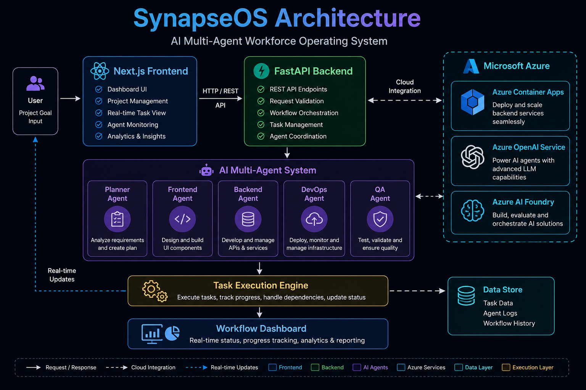

# SynapseOS
### AI Multi-Agent Workforce Operating System

SynapseOS is an AI-powered multi-agent workforce orchestration platform built to automate software project execution workflows using autonomous AI agents.

Built for the Microsoft Build AI Hackathon.

---

# Problem Statement

Modern software teams lose significant productivity due to:
- fragmented workflows
- repetitive project coordination
- manual task tracking
- disconnected tooling
- inefficient collaboration

Organizations need AI-native systems that can autonomously coordinate workflows, assign tasks, and streamline execution.

---

# Solution

SynapseOS introduces an AI Multi-Agent Workforce Operating System that:
- accepts project goals
- autonomously creates workflows
- assigns specialized AI agents
- tracks execution status
- visualizes project progress in real time

The platform simulates how future AI-native engineering organizations will operate.

---

# Features

- AI-powered workflow orchestration
- Multi-agent task execution
- Real-time workflow dashboard
- Dynamic project creation
- Agent-based execution model
- Interactive modern UI
- REST API architecture
- Azure-ready deployment architecture

---

# AI Agents

| Agent | Responsibility |
|---|---|
| Planner Agent | Requirement analysis |
| Frontend Agent | UI generation |
| Backend Agent | API orchestration |
| DevOps Agent | Deployment workflows |
| QA Agent | Validation and testing |

---

# Tech Stack

## Frontend
- Next.js
- TypeScript
- Tailwind CSS
- Framer Motion

## Backend
- FastAPI
- Python
- Uvicorn

## AI & Cloud
- Microsoft Azure
- Azure Container Apps
- Azure AI ecosystem
- GitHub Copilot

---

# Architecture



---

# Workflow

1. User enters project goal
2. FastAPI backend initializes workflow
3. AI agents are assigned specialized tasks
4. Task execution pipeline updates statuses
5. Frontend dashboard visualizes execution progress

---

# Project Structure

```bash
synapseos-ai-workforce/
│
├── backend/
│   ├── main.py
│   ├── requirements.txt
│   └── Dockerfile
│
├── frontend/
│   ├── app/
│   ├── components/
│   ├── package.json
│   └── tailwind.config.js
│
├── synapseos-architecture.png
└── README.md
```

---

# Installation

## Clone Repository

```bash
git clone https://github.com/Bunny-cell11/synapseos-ai-workforce.git
```

---

# Backend Setup

```bash
cd backend

pip install -r requirements.txt

uvicorn main:app --reload
```

Backend runs at:

```bash
http://127.0.0.1:8000
```

---

# Frontend Setup

```bash
cd frontend

npm install

npm run dev
```

Frontend runs at:

```bash
http://localhost:3000
```

---

# API Endpoints

| Endpoint | Method | Description |
|---|---|---|
| `/` | GET | Health check |
| `/start-project` | POST | Start workflow |
| `/tasks` | GET | Fetch tasks |

---

# Microsoft Build AI Alignment

This project aligns with:
- AI at Work
- Agent Swarms
- AI-Powered Production Function

by demonstrating:
- autonomous workflow orchestration
- AI-native task execution
- collaborative multi-agent systems

---

# Future Improvements

- Azure OpenAI integration
- Real autonomous AI planning
- Agent memory systems
- LangChain orchestration
- CrewAI integration
- Real-time WebSocket updates
- Vector database memory
- Multi-user collaboration

---

# Demo Video

Demo Video Link:
(Add your YouTube/Drive link here)

---

# Team

Pagidi Kondala Bhavani

---

# AI Tools Used

- GitHub Copilot
- ChatGPT
- Microsoft Azure AI ecosystem

---

# License

MIT License
